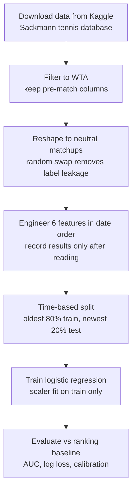

# WTA Match Predictor

A model that predicts the winner of women's professional tennis (WTA) matches from pre-match information only: ranking, recent form, surface history, head-to-head, age, and height. It reaches 0.694 AUC on matches it has never seen, beating a ranking-only baseline, with well-calibrated probabilities.

[](https://colab.research.google.com/github/e-akselrod/tennis-match-predictor/blob/main/WTA_Match_Predictor.ipynb)


The model is a plain logistic regression. The care went into the evaluation, because that is where these projects usually go wrong.

## Contents
- [Why this exists](#why-this-exists)
- [Quick start](#quick-start)
- [Results](#results)
- [Features](#features)
- [How it stays honest](#how-it-stays-honest)
- [How it works](#how-it-works)
- [What this is not](#what-this-is-not)
- [Roadmap](#roadmap)
- [Installation](#installation)
- [Data and license](#data-and-license)
- [Contributing](#contributing)

## Why this exists

Predicting tennis from rankings is easy to do badly. The winner and loser are baked into the raw data's column order, so a careless model just learns that the winner column wins. Form and surface features are easy to compute with future results leaking in. And accuracy is a misleading scoreboard, because ranking alone already calls most matches. This project builds the features the leak-free way, scores the model the way that actually separates signal from noise (AUC, log loss, calibration), and asks an honest question: once you know the rankings, how much do form, surface, and head-to-head really add?

## Quick start

```bash
git clone https://github.com/e-akselrod/tennis-match-predictor.git
cd tennis-match-predictor
pip install -r requirements.txt
jupyter notebook WTA_Match_Predictor.ipynb   # run top to bottom
```

The notebook pulls data from Kaggle, so you need a free Kaggle account and an API token (`kaggle.json`), which the notebook prompts you to upload. You can also open it directly in Colab with the badge above.

## Results

Evaluated on the held-out test set (the most recent 20% of matches by date). The baseline makes hard picks, so AUC and log loss do not apply to it:

| Model | Accuracy | AUC | Log loss |
|---|---|---|---|
| Baseline (pick higher-ranked player) | 0.639 | n/a | n/a |
| Ranking only | ~0.64 | 0.689 | 0.646 |
| Full model (6 features) | 0.641 | 0.694 | 0.641 |

The full model edges out ranking alone where it counts: AUC 0.689 to 0.694, log loss 0.646 to 0.641, with probabilities that stay well calibrated. The gain is small, and that is expected, because ranking already reflects a player's recent results. Accuracy barely moves because ranking settles most matches and every model gets those right. The improvement lives in the probability estimates, which is exactly what AUC and log loss measure. Beating a ranking baseline in tennis is genuinely hard and an active research area, so a real gain measured the right way, with honest calibration, is a meaningful result.

The feature weights are the more interesting read. They are scaled, so the sizes are directly comparable:

| Feature | Scaled weight | Reading |
|---|---|---|
| Log ranking gap | about -1.0 | Dominant. Rankings carry most of the signal. |
| Surface win rate | +0.14 | Strongest addition. Clay-versus-grass specialists are real. |
| Age gap | -0.12 | With ranking held equal, the younger player is favored slightly. |
| Head-to-head | +0.09 | A small but real edge from past meetings. |
| Recent form (last 20) | +0.05 | Surprisingly weak. This is itself the finding. |
| Height gap | small | Little independent effect. |

The weak form weight is worth sitting with: over a 20-match window, recent form barely adds anything ranking does not already capture.

## Features

Six features, each expressed as a player 1 minus player 2 difference:

| Feature | What it captures |
|---|---|
| Log ranking gap | Relative strength on a log scale, because the gap between #1 and #50 matters far more than #200 to #250. |
| Recent form | Win rate over each player's last 20 matches, catching hot and cold streaks a stale ranking misses. |
| Surface win rate | Win rate on the current surface (hard, clay, grass), which ranking hides. |
| Head-to-head | A player's edge in prior meetings between the two (zero for most pairs). |
| Age gap | Difference in age. |
| Height gap | Difference in height. |

## How it stays honest

- **Neutral matchups.** Every match is reshaped into player 1 vs player 2 with a random half swapped, so column order carries no signal. A player-1 win rate near 0.50 confirms it.
- **No lookahead.** Form, surface, and head-to-head are computed in a single date-ordered pass, and each result is recorded only after it has been read, so a match never sees its own outcome.
- **Time-based split.** The model trains on the oldest 80% of matches and is tested on the most recent 20%, which mirrors how you would actually use it: predicting forward, not backward.
- **No leakage in scaling.** The standard scaler is fit on the training rows only, so nothing from the test set influences the model.

## How it works



## What this is not

- **Not a betting tool.** The edge over a ranking baseline is small and not designed to beat market odds.
- **Women's tour only.** Trained and tested on WTA matches.
- **A linear model.** Logistic regression cannot capture interactions between features (the roadmap covers this).
- **All-time surface history.** Surface win rate uses a player's full career on that surface, not a recent window, so old results count as much as current ones.

## Roadmap

Natural next steps: try gradient boosting to model the feature interactions a linear model cannot, add fatigue signals such as matches played in the last week, or replace all-time surface win rate with a recent window so current surface form counts for more.

## Installation

Requires Python 3.9 or newer. Dependencies (pandas, numpy, scikit-learn, matplotlib, kaggle) install with:

```bash
pip install -r requirements.txt
```

## Data and license

Data is Jeff Sackmann's public tennis database, used under CC BY-NC-SA 4.0 (attribution, non-commercial, share-alike). That license governs the data and any results derived from it, so this project is for non-commercial use. The code is released under the MIT License (see LICENSE).

## Contributing

This is a personal portfolio project. Issues and suggestions are welcome through the GitHub issue tracker.
